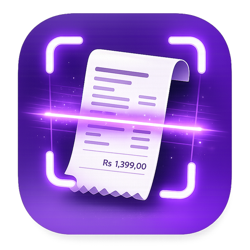
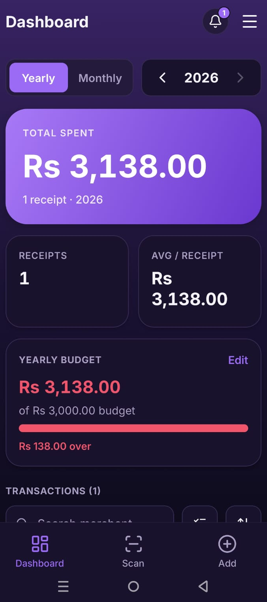
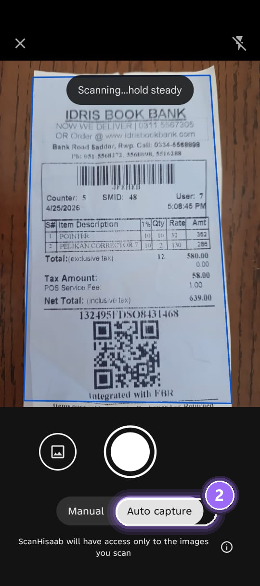
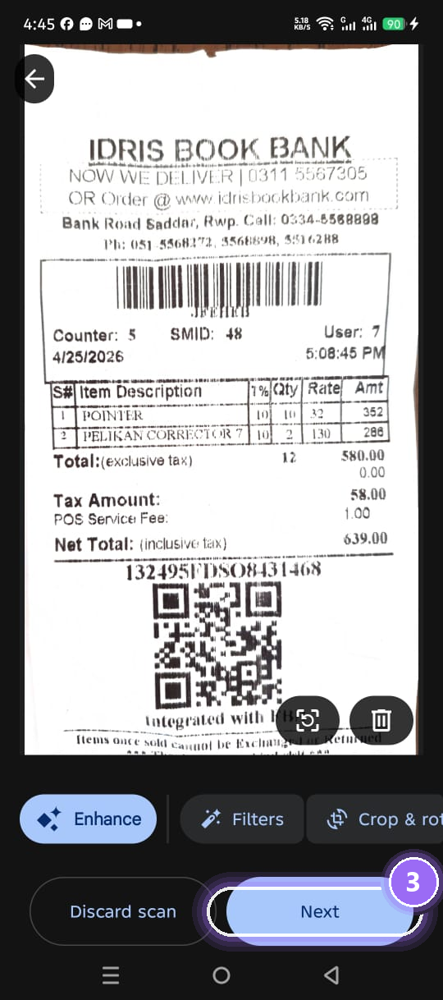
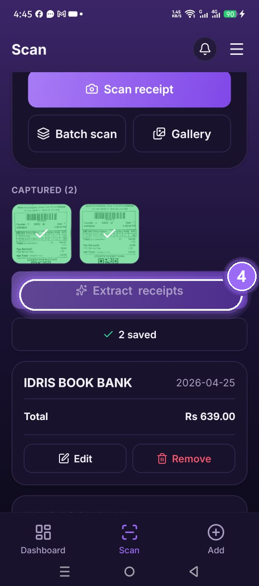
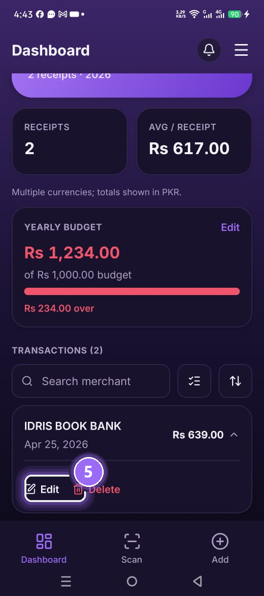
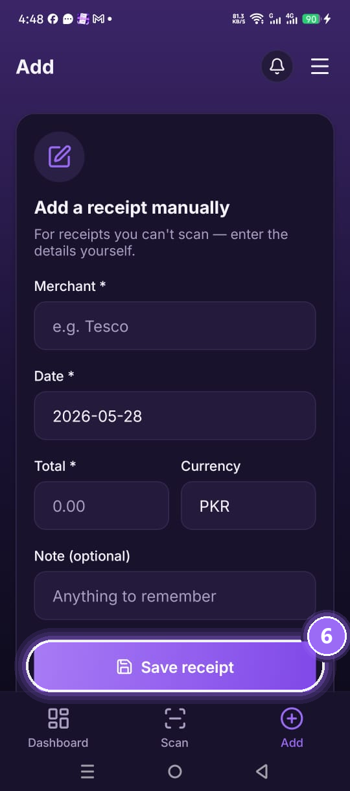
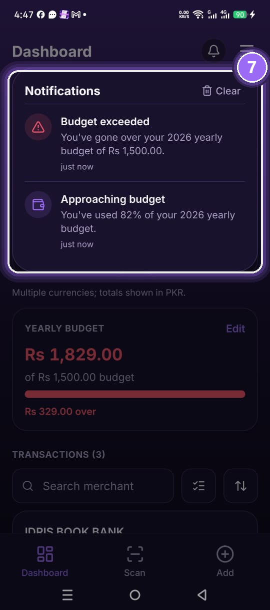
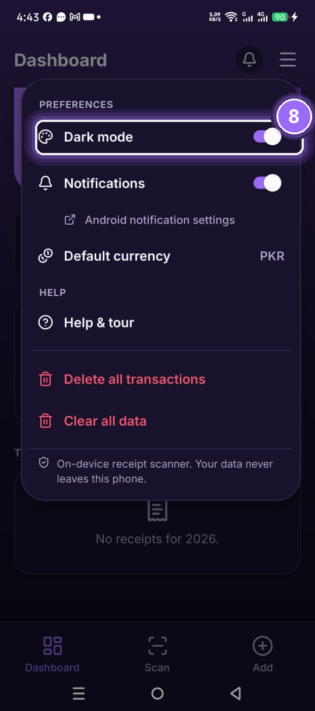

# ScanHisaab

**On-device receipt scanner and budget tracker.**

Privacy by default — no backend, no accounts, no telemetry.

---

## What it does

Point your phone at a paper receipt and ScanHisaab reads the merchant, date and total for you. It keeps a running tally of what you've spent, fits it against a monthly or yearly budget you set, and gives you a heads-up before you go over. You can also add receipts by hand, edit any of them later, switch between dark and light mode, and pick your default currency. Nothing leaves your phone — no accounts, no sign-in, no uploads.

## How to use it

<table>
  <tr>
    <td align="center" width="25%">
       
      <b>1. Dashboard</b> 
      Total spent, receipts and budget at a glance. Tap Yearly / Monthly to switch the view.
    </td>
    <td align="center" width="25%">
       
      <b>2. Auto-capture</b> 
      Open the Scan tab and hold the camera steady. It snaps the moment the receipt is in focus.
    </td>
    <td align="center" width="25%">
       
      <b>3. Review the crop</b> 
      Adjust the crop, enhance or rotate if you want, then tap Next to keep the shot.
    </td>
    <td align="center" width="25%">
       
      <b>4. Extract &amp; save</b> 
      Tap Extract receipts to read seller, total and date — fully on-device. Each one saves automatically.
    </td>
  </tr>
  <tr>
    <td align="center">
       
      <b>5. Edit any time</b> 
      Tap any receipt on the dashboard to expand it. Use Edit to fix details, or Delete to remove it.
    </td>
    <td align="center">
       
      <b>6. Add manually</b> 
      Some receipts can't be scanned. Tap the Add tab to enter merchant, date and total by hand.
    </td>
    <td align="center">
       
      <b>7. Budget alerts</b> 
      Set a yearly or monthly budget on the dashboard. You'll get a heads-up at 80% and over.
    </td>
    <td align="center">
       
      <b>8. Settings menu</b> 
      Open the burger menu anytime for dark mode, notifications, default currency, help and clearing data.
    </td>
  </tr>
</table>

## Why "ScanHisaab"

*Hisaab* (حساب) is Urdu/Hindi for *accounts* — so the name is simply "scan your accounts."

## License

MIT — see [LICENSE](./LICENSE) for details.
